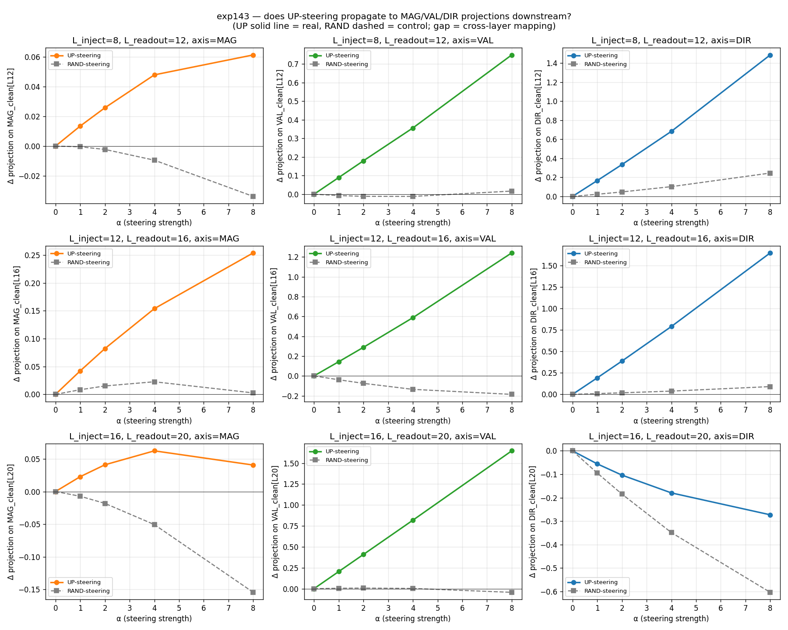
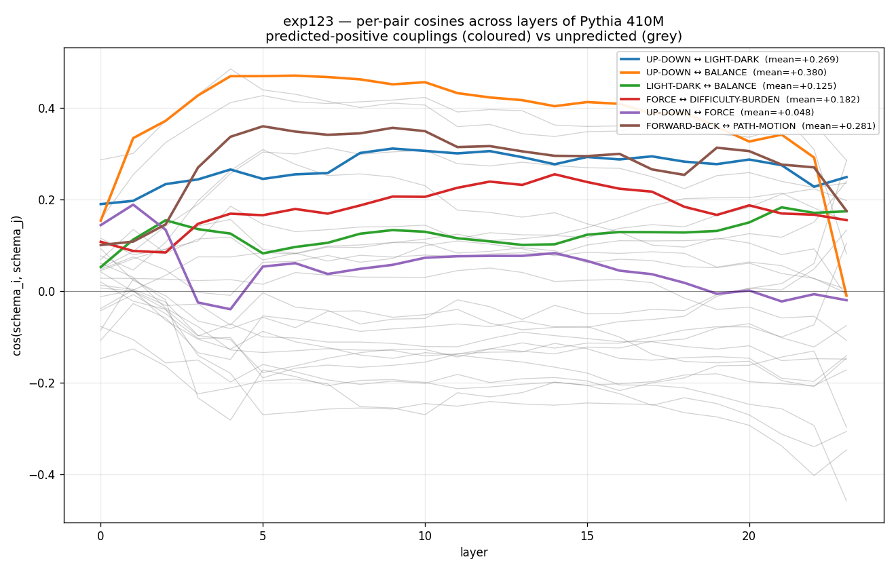
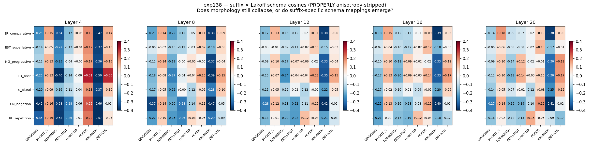
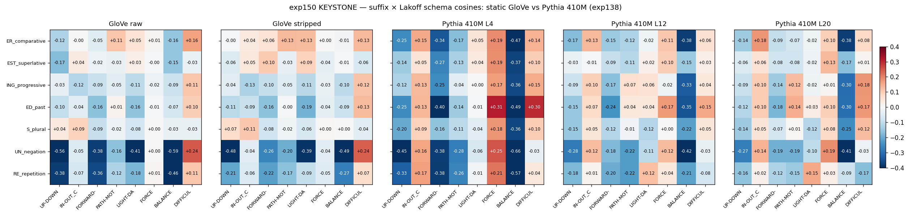
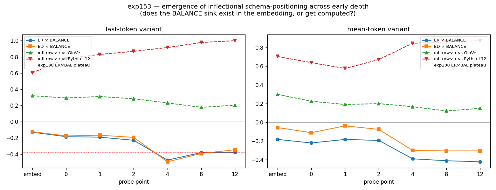
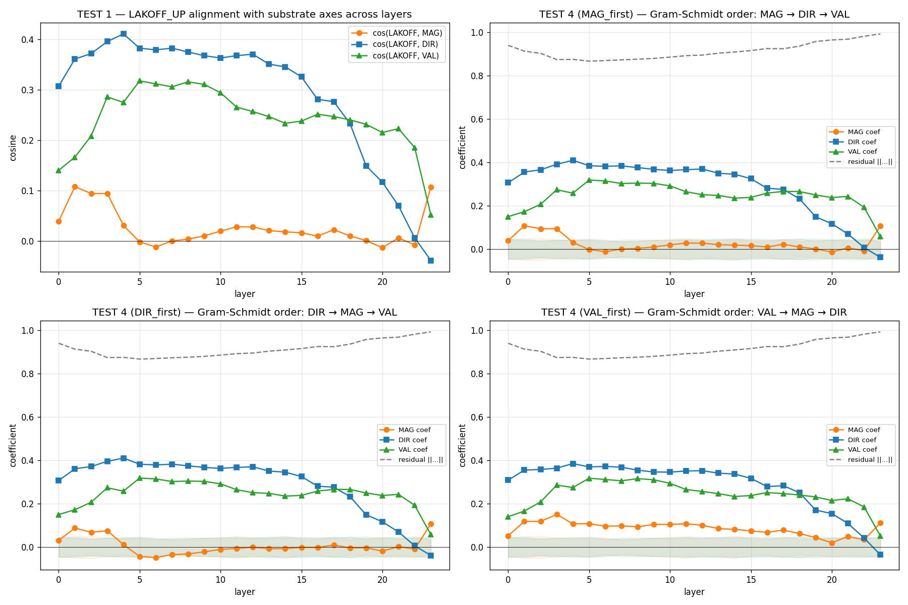
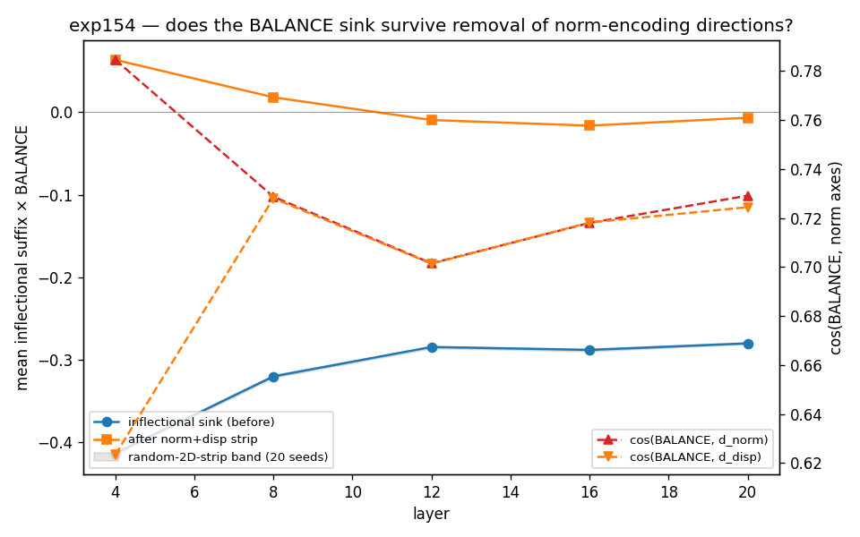

# Embodied Cognition in Transformers

*Image schemas, metaphorical mappings, and computational grounding in language models trained on text alone*

---

**TL;DR.** George Lakoff argued that abstract thought is organised by image schemas (UP-DOWN, BALANCE, PATH, FORCE) that arise from having a body, and that this is why disembodied language models cannot have structurally grounded meaning. Across 164 experiments, ten of them pre-registered, and three model families, we find that the structural form of that embodied organisation is measurably present in transformers:

- The eight canonical Lakoff schemas exist as stable directions in the residual stream, recoverable from single-word activations, and they form the specific relational system Lakoff predicted (predicted inter-schema couplings +0.21, unpredicted +0.00).
- Steering on the UP direction causally shifts valence (HAPPY-IS-UP), beating a random-direction control by +0.72 to +0.94, dose-responsively, as a cross-layer transformation.
- The transformer reorganises inflectional morphology onto the schema axes. Static embeddings (GloVe, word2vec, fastText) trained on the same co-occurrence statistics don't: the inflectional BALANCE sink is about −0.38 in Pythia and ~0.00 in the static spaces.
- BALANCE is grounded on the model's own computational operations: residual norm in Pythia (held-out cos +0.64 to +0.77), attention entropy in GPT-2 and Llama (−0.14 to −0.32; pre-registered, triple-replicated). Different models found different computational "bodies": multiple realizability.
- The causal arrow is one-way. Manipulating the computational operation shifts the concept (confirmed, specificity 7/7); pushing the concept does not steer the operation (failed). The substrate shapes the concept, as embodied cognition predicts.

The claim is not consciousness or phenomenology. It is that Lakoff's structural argument against LLM grounding (no body, therefore no schemas, therefore defective meaning) fails on its own terms: the schemas are there, they work, and the model's computational physiology plays the role the body plays in humans.

---

## The question

George Lakoff and Mark Johnson argued that abstract thought is structured by *image schemas*: UP-DOWN, IN-OUT, BALANCE, FORCE, PATH, patterns arising from bodily experience and projected metaphorically into abstract domains. HAPPY IS UP. MORE IS UP. DIFFICULTY IS A BURDEN. In Lakoff's framework these schemas are the building blocks of meaning. They come from having a body, and they cannot come from anywhere else.

This has become a foundational argument against the idea that language models can have grounded meaning. The reasoning is direct: LLMs have no body. No body means no image schemas. No image schemas means no embodied cognitive structure, so LLM meaning is structurally defective. It may approximate understanding, but it lacks the organisational backbone that human cognition runs on.

Two things get run together here and it's worth separating them. The symbol grounding problem, as Harnad posed it in 1990, asks how symbols in a formal system come to mean anything at all rather than merely pointing at further symbols. Lakoff's image-schema account is one *answer* to that question: symbols get their content from recurring patterns of bodily experience. What has happened since is that the answer gets deployed as a test: no body, no schemas, no grounding. This post is aimed at the answer, not the question. Nothing here shows that a transformer's representations refer to anything in the world. What it shows is that the specific organisational structure Lakoff says only a body can produce is present in a system that hasn't got one. That narrows the argument; it doesn't settle it.

This post presents evidence that the structural form of that organisation (the schemas, their metaphorical mappings, their extension into grammar, and their grounding on computational substrate) is present in transformer language models trained on text alone. Present in a form you can measure and steer, not as a metaphor. The evidence spans 164 experiments, ten pre-registered confirmatory tests, and three model families.

There is an obvious objection, and it deserves to be stated before the evidence: *of course* the schemas are in the text statistics. The training corpus was written by embodied humans who think in these schemas; a model that compresses that corpus will inherit their shadow. On this view the findings below are just distributional semantics with extra steps. Two of the five findings are specifically aimed at that objection. Finding 4 shows that static embeddings trained on the same co-occurrence statistics develop a *different* morphological geometry. The transformer doesn't inherit the schema-anchored organisation from the statistics; it builds it. Finding 5 shows that one schema is coupled to the model's own computational operations, quantities like residual norm and attention entropy that do not exist in the training text at all, and that the coupling is causally directed from operation to concept. Whatever those two results are, they are not properties of the corpus.

The claim is careful. I am not claiming transformers are conscious, or that they have phenomenological experience, or that they "understand" in the way embodied beings do. I am claiming that the *structural form* of embodied cognitive organisation that Lakoff identified is reconstructible by a transformer, with the transformer's own computational substrate playing the role the body plays in humans. The form is substrate-general. The body was the human-specific instance.

Five findings, in order:

1. **You don't need sentences to build the contrast vectors.** Single-word activations carry the full metaphorical cluster.
2. **Steering on a spatial UP vector shifts the model's valence.** HAPPY-IS-UP is a causal, cross-layer transformation.
3. **Lakoff schema vectors form a stable relational system** across the depth of the model.
4. **Morphological operators position on the schema axes** in the transformer, but not in static embeddings like word2vec or GloVe.
5. **BALANCE is grounded on computational operations** (residual norm in Pythia, attention entropy in GPT-2 and Llama) with a one-way causal arrow from operation to concept.

---

## Finding 1: Single words suffice

### The method

The basic tool of this work is the *contrast vector*: take a set of UP words (high, top, rise, above, peak, ascend, climb...) and a set of DOWN words (low, bottom, fall, below, valley, descend...), run each word through the model as a bare single token, extract the residual stream activation at a chosen layer, and compute:

> **v = mean(UP-word residuals) − mean(DOWN-word residuals)**

This vector is the UP-DOWN schema direction in the model's internal geometry. The same procedure builds LIGHT-DARK, FORWARD-BACK, BALANCE, IN-OUT, PATH-MOTION, FORCE, and DIFFICULTY-BURDEN: the eight canonical Lakoff image schemas, using curated vocabulary drawn from the Master Metaphor List.

Here is the first surprise: you don't need sentences. The schema is already packed into single-word activations. No context, no sentence frame, no syntactic construction, just the word alone. The model has internalised the embodied structure so deeply that a single token ("up") carries the full metaphorical cluster: HAPPY-IS-UP, MORE-IS-UP, HIGH-STATUS-IS-UP, GOOD-IS-UP.

To calibrate the surprise: it is not news that word representations carry semantics. Static embeddings have supported analogy arithmetic since word2vec. What is not obvious is that a bare token's *contextual* activation, with no sentence to construct meaning in, carries the whole cross-domain metaphorical bundle as a single steerable direction, and that (Finding 2) injecting that direction causally transfers across domains, from spatial verticality to affective valence. Static analogy arithmetic never showed that.

This parallels what happens in human cognition, where hearing a single word activates sensorimotor areas. The model doesn't need a sentence to construct the schema; the schema is already there.

### The frequency confound, and its resolution

The second surprise was a confound that nearly killed the finding, and the control that saved it.

We built the UP-DOWN contrast twice, from two independently curated word lists: a hand-picked strictly-spatial set, and a set drawn from Lakoff's anchors. Two constructions of the same concept should agree. Instead, the cosine between them was −0.990. Anti-parallel. The two "UP" vectors pointed in opposite directions. Something was wrong.

The something was frequency, and the mechanism is worth spelling out because it will bite anyone doing steering work. Pythia's residual space contains a dominant frequency direction. We built one explicitly, from twenty very common function words versus five rare content words, and its contrast norm came out at 1254, against 130 to 197 for the semantic contrasts. Both raw UP vectors sat almost exactly on this axis, from opposite sides: the hand-picked contrast at cos −0.995, the Lakoff contrast at +0.998. The reason is that the two word lists have opposite frequency asymmetries. A SUBTLEX audit showed the Lakoff UP anchors are far more frequent than their DOWN counterparts (mean frequency 20,396 vs 9,004), while the hand-picked UP list is slightly rarer than its DOWN list. Each raw "UP" vector was roughly 99% frequency, with opposite signs, and the −0.990 cosine was just those two frequency components staring at each other.

We stripped it. After regressing out the frequency axis, the cosine between the two cleaned UP directions jumped from −0.990 to +0.571. The number that still startles me is cos(clean, raw) = +0.096 and +0.063: the semantic direction that survives cleaning is nearly orthogonal to the vector you would naively have steered with.

And the affect shift, the degree to which steering on the vector moves the model toward positive versus negative sentiment (measured on Pythia 1.4B at layer 12, steering strength s = +12), amplified: from +0.083 nats raw to +0.446 cleaned for the hand-picked contrast (5×), and from +0.051 raw to +0.677 cleaned for the Lakoff contrast (13×), the latter being roughly a 2× odds-ratio shift on positive-versus-negative affect tokens. Two critical controls. Steering along the pure frequency axis moved affect by only +0.011 nats, so the affect signal is not a Pollyanna-principle frequency artifact. A matched-norm random direction moved it by +0.005. The effect is monotone in steering strength and near-symmetric around zero (−0.464 at s = −12 vs +0.446 at s = +12).

Honesty requires reporting what *didn't* survive this experiment. The original steering battery had three behavioural measures: affect, expected height, and expected quantity. Two died under scrutiny. The quantity measure proved unreliable: the two cleaned directions shifted it in opposite directions, and a random-direction push moved it too. It was measuring model degradation under steering, not semantics. The height measure had a validity problem: the model rarely completes "His height in centimetres is" with centimetre integers, so the battery measures relative reordering within a sliver of completion space it almost never visits. Both cleaned directions did shift expected height positively (+1.07 and +0.69 cm), consistent with the MORE-IS-UP reading, but we don't rest weight on a DV with a known validity issue. The affect result, replicated across two independent anchor sets and robust to frequency and random controls, is the finding.

### What this means

The contrast vector method works because the model has already done the work of packing embodied structure into token representations. We're not constructing the schema by averaging over sentences that mention verticality; we're reading off a schema that already lives in the geometry of single-word activations. The model learned it from text written by embodied humans who think in these schemas, and internalised it so thoroughly that a single word carries the whole cluster.

This is the foundation everything else builds on. The schemas are in there. The question is what they do.

---

## Finding 2: Steering on UP makes the model happier

### The causal test

If the UP-DOWN direction is really carrying the HAPPY-IS-UP metaphorical mapping, then adding it to the model's residual stream should shift the model's output toward positive valence. This is *activation steering*: inject a vector into the residual stream at a chosen layer, let the model continue processing, and measure what changes.

The result, on Pythia 410M, injecting at layer 12 (ΔValence is the shift in projection onto an anisotropy- and frequency-stripped valence axis at the readout layer):

| Steering (α=4) | ΔValence at L14 | ΔValence at L16 | ΔValence at L23 |
|---|---|---|---|
| UP direction | +0.69 | +0.59 | +0.46 |
| Random direction | −0.03 | −0.14 | −0.48 |
| Gap | +0.72 | +0.72 | +0.94 |

UP-steering shifts valence far above the random-direction control. It's dose-responsive, linear in steering strength α from 1 to 8, and it persists across injection layers (L8, L12, L16). The raw shift decays gently with depth, as injected signals do, but the advantage over the random control *grows* with depth (+0.72 at L14 to +0.94 at L23), because random directions drift increasingly negative while UP holds up. And it isn't only valence: UP-steering shifts magnitude projections too (MORE-IS-UP), and direction projections at mid layers (that one flips negative at the final layer). One direction, multiple metaphorical mappings moving together through most of the stack.

*Valence, magnitude, and direction projections at downstream layers after UP-steering (blue) vs random-direction control (grey) at L12, α=4. UP produces large positive valence shifts through L14 to L23; random stays flat or negative.*

(A note on what we deliberately don't show: free-generation samples under steering. Generations exist in the project record, but they were produced with the raw pre-cleaning vector and are noisy seed-to-seed. Selectively quoting the ones that fit would be exactly the kind of evidence this project is trying not to produce. The quantitative log-probability measures above, with their controls, are the evidence.)

### It's a cross-layer transformation, not a within-layer alignment

One thing the UP direction is *not*: aligned with a "magnitude" axis within a single layer. cos(UP, magnitude) is about +0.03 at the injection layer, and never exceeds +0.11 anywhere in the stack. The model does not represent "up" as "bigger" within a layer. Yet UP-steering shifts magnitude projections downstream. The MORE-IS-UP mapping is a *cross-layer* transformation: injecting UP at layer 12 produces magnitude shifts at layers 14 to 23, executed by the attention and MLP computation between those layers.

The valence case needs one honest number: within layer 12, cos(UP, valence) = +0.25. The UP direction has a modest static lean toward valence before any computation. But the downstream valence shifts (+0.46 to +0.69) are far larger than that static overlap alone would produce, and the matched-norm random control shows the readout axes aren't simply picking up any injected vector. HAPPY-IS-UP, like MORE-IS-UP, is mostly *computed* between layers, not stored as a within-layer alignment.

This matters because it means the metaphorical mappings live in the circuitry, the same way human metaphorical understanding lives in the processing rather than in a static lookup table.

### Controls and caveats

The random-direction control is the load-bearing one: UP beats it by +0.72 to +0.94 at α=4. A "meaningful non-Lakoff" control (steering on concrete-vs-abstract, animate-vs-inanimate, and noun-vs-verb directions) showed that UP produces the largest valence shift, roughly 2× the next best. It also revealed that a structural late-layer pull toward valence exists for the orthogonal meaningful directions generally (about +0.20 to +0.30 ΔValence), with one unexplained exception: animate-vs-inanimate went negative. The specific UP→valence mapping is real and largest, but it is not the only thing pulling toward valence at late layers.

An unresolved question, flagged in the introduction: the UP→valence mapping could arise from text statistics (human writers do encode HAPPY-IS-UP in their word choices) rather than from anything the transformer adds. Distinguishing "the model learned the metaphor from text" from "the model's architecture reconstructs the metaphor" needs a comparison substrate trained on the same statistics without the transformer machinery. That is exactly what Finding 4 provides.

---

## Finding 3: A stable schema relational system

### The system, not just the axes

If the eight Lakoff schemas are just eight independent directions, that's interesting but not surprising. Any clustering method can find directions. The question is whether they form a *system*: do the schemas relate to each other in the way Lakoff predicted, and is that relational structure stable across the model's depth?

Lakoff's framework predicts specific inter-schema couplings. UP-DOWN should couple with BALANCE (upsetting the balance) and with LIGHT-DARK (bright is up, dark is down). FORWARD-BACK should couple with PATH-MOTION (moving along a path). FORCE should couple with DIFFICULTY (resistance is force). These follow from the embodied logic of the schemas, and we declared six of them as predictions before scoring.

We measured the 8×8 pairwise cosine matrix of schema directions at every layer of Pythia 410M (24 layers), and asked whether the relational *configuration*, the pattern of which schemas couple with which, persists across layers.

Yes, strongly. The cross-layer configuration similarity is +0.91, against a strong null (random anchor partitions, same words) of +0.79. All six predicted couplings come out positive on average: UP↔BALANCE +0.38 (positive at 23 of 24 layers), FORWARD-BACK↔PATH +0.28 (24/24), UP↔LIGHT-DARK +0.27 (24/24), FORCE↔DIFFICULTY +0.18 (24/24), LIGHT-DARK↔BALANCE +0.13 (24/24), and the weakest, UP↔FORCE, +0.05 (positive at only 18 of 24). The predicted mean of +0.21 is over all six, weak one included. The 22 unpredicted couplings average +0.004, indistinguishable from zero. What's present is specifically the system Lakoff described, not a generic clustering.

*Predicted (blue) vs unpredicted (grey) inter-schema couplings across the 24 layers. Five of the six predicted couplings are positive at 23 or more layers; unpredicted couplings hover at zero.*

One depth caveat belongs in the headline rather than the fine print: the configuration is established early and persists through the stack, but the final layer partially reorganises toward the output. L23's similarity to earlier layers drops to +0.46 to +0.86, against +0.9 or better mid-stream. "Stable through the stack, reorganised at the readout" is the accurate summary.

### Per-axis stability

Each individual schema axis is also cross-layer stable. Measuring the mean cosine of a schema direction across layers L4 to L22:

| Schema | Cross-layer stability (mean) |
|---|---|
| IN-OUT | +0.83 |
| UP-DOWN | +0.81 |
| LIGHT-DARK | +0.80 |
| FORCE | +0.79 |
| FORWARD-BACK | +0.77 |
| PATH-MOTION | +0.77 |
| DIFFICULTY | +0.77 |
| BALANCE | +0.74 |

All schemas preserve their direction across depth. The antonymy sanity check passes: cos(schema, flipped) = −1.000 for all eight schemas at the probed layers (L0, L12, L23). These are genuine bipolar axes, not artifacts.

One honest footnote: an alternative per-pair stability measure is mixed. Several BALANCE-involving pairs are individually *less* stable than the null (variance ratios 1.4 to 1.9). The configuration-level result, the whole-matrix pattern, is the one that holds; individual pairwise couplings wobble more.

### The representational-system distinction

Not every word cluster is a representational system. We compared Lakoff schemas against other linguistic categories (quantifiers, determiners, logical operators) on the same cross-layer matrix-preservation measure. Lakoff schemas (+0.91), quantifiers (+0.96), and determiners (+0.95) all preserve their inter-axis structure across layers, well above the null. Logical operators sit *at* the null: +0.78 against +0.79. And this is not because the operator axes themselves are unstable. Individually they are among the most stable directions we measured (means +0.82 to +0.90). What logical operators lack is preserved *relational* structure.

The interpretation: Lakoff schemas are a coordinated representational system whose axes relate to each other in a structured way that persists across depth. Logical operators ("and", "or", "not", "if") are a folk category, individually present but not systemically organised. The distinction is measurable, and Lakoff's schemas pass it.

### Caveat

The cross-layer matrix-preservation test has two subtleties. Generic word-difference matrices also preserve shape across layers, so the test is informative as a *relative* comparison between clusters, not as standalone proof of "coordinated system." And the null we compare against is the random-partition null built from the Lakoff anchors; we did not build cluster-specific nulls for the other categories. The Lakoff-specificity test, predicted couplings +0.21 versus unpredicted +0.00, is the stronger evidence.

---

## Finding 4: Morphology on the schema axes, and the word2vec keystone

### Suffixes land on schemas

If the schema system is the model's organising geometry for meaning, then grammatical operators, the combinatorial machinery of language, should live in the same geometry. We tested this by building contrast vectors for seven English morphological operators (-ING progressive, -ED past, -S plural, -ER comparative, -EST superlative, un- negation, re- repetition) as pair-differences ("walking" minus "walk", averaged over many pairs) and projecting them onto the schema axes.

This required a methodological repair that proved essential: raw pair-difference vectors have |cos| of about 0.55 to 0.59 with the space's anisotropy direction, which collapses everything into superficial similarity. After per-layer anisotropy and frequency stripping, the real structure emerged, and it is simpler than the version an earlier draft of this post told. Two mappings are robust:

| Operator(s) | Schema | Stripped cosine across probed layers |
|---|---|---|
| all seven | BALANCE, negative (the shared "markedness sink") | −0.15 to −0.50 (at L12: −0.15 to −0.38) |
| -ED (past) | FORWARD-BACK, negative | −0.18 to −0.40, every probed layer |
| re- (repetition) | FORWARD-BACK, negative | −0.12 to −0.38, every probed layer |

The FORWARD-BACK mappings are conceptually coherent on Lakoff's own terms: the past is behind you, repetition goes back along the path. And every operator shares the BALANCE-negative component, which we initially read as inflection-as-departure-from-equilibrium (Finding 5 revises what that component actually is).

Two prettier mappings from earlier drafts did not survive audit, and I want them retracted in public rather than quietly dropped. -ING onto PATH-MOTION ("progressive aspect is motion along a path"): the actual loadings run −0.04 to +0.12 across layers, sign-flipping, and are dwarfed by -ING's own BALANCE loading of about −0.33. un- onto LIGHT-DARK ("negation is the dark side"): −0.06 to −0.14 in Pythia, and GloVe shows the same mapping at −0.39, three times stronger, so whatever it is, it is not transformer-specific. Both stories were lovely. Neither is supported.

*Operator × schema projection matrix after anisotropy and frequency stripping. The shared BALANCE-negative column and the -ED/re- FORWARD-BACK loadings are the robust structure.*

### The word2vec keystone: the transformer reorganises what static embeddings don't

Here is the result that makes this more than "the model learned correlations from text."

We ran the identical protocol (same suffix pairs, same schema axes, same anisotropy and frequency stripping) on three static distributional embeddings: GloVe, word2vec, and fastText. These are trained on the same kind of co-occurrence statistics a transformer sees during training. If the schema-morphology mappings were just inherited from textual co-occurrence, they should appear in static embeddings too.

They don't. At least, not the ones that matter.

The headline number is the ER×BALANCE cell, the sharpest probe of the inflectional markedness sink: about −0.38 in Pythia at layers 8 through 20, and −0.47 at layer 4 (five layers probed). In GloVe it is −0.01. In word2vec, −0.005. In fastText, +0.01. The static spaces sit at zero; the transformer does not. (One scope note: fastText's subword architecture builds suffix coherence in, so its own results file classes it as supplementary evidence rather than a clean distributional control. GloVe and word2vec carry the comparison.)

This isn't because static embeddings have *no* morphology geometry. They do; it's just different. The static spaces agree with each other on inflectional geometry (static-to-static r = 0.71 to 0.77) but correlate only weakly with the transformer's (static-to-Pythia r = 0.20 to 0.36, above chance in six of nine substrate-by-layer tests but far below the static-to-static agreement). There is a consistent inflectional geometry in static space; the transformer *replaced* it with a different one, anchored on the schema system.

*Suffix-schema matrices in GloVe (left) vs Pythia L12 (right). The inflectional BALANCE sink (bottom row) is present in Pythia and absent in GloVe. Derivational prefixes (un-, re-) appear in both.*

A post-hoc split clarifies the picture. The *derivational* operators (un-, re-) do replicate across static and transformer spaces (r = 0.50 to 0.72): their schema positioning is distributional, inherited from co-occurrence. The *inflectional* suffixes (-ING, -ED, -ER, -EST, -S) are where the geometries diverge. The transformer reorganises inflectional morphology onto the schema system; static embeddings leave it somewhere else.

### Where in depth does the reorganisation happen?

The inflectional BALANCE sink is partially written into Pythia's own embedding matrix (ER×BALANCE = −0.13 before any layers run), then computed to full strength between layers 2 and 4 (−0.23 to −0.47), plateauing by layer 8. The inflectional geometry at layer 12 correlates r = +0.60 with the embedding matrix, r = +0.92 with layer 4, and r = +0.98 with layer 8. It's partly trained in, mostly computed.

*ER×BALANCE (inflectional markedness sink) across depth: partially present at the embedding (−0.13), computed to full strength by L4 (−0.47), plateauing from L8.*

### What this means

This is the closest the work gets to answering "did the model just learn this from text, or did its architecture reconstruct it?" Static embeddings learn from the same co-occurrence statistics. They develop a consistent inflectional geometry, but a different one, one that doesn't anchor on the schema system. The transformer doesn't inherit the schema-morphology mapping from distributional statistics. It builds a new one.

Something about the transformer architecture and its training dynamics enables a reorganisation that pure distributional learning doesn't. The mechanism is unknown. Every mechanistic explanation we've proposed has died under testing (more on that below). But the dissociation replicates fully on Pythia 1.4B, and the underlying BALANCE-norm coupling it rests on (Finding 5) holds across all four Pythia sizes from 70M up.

### Honest caveats

The derivational/inflectional split is post-hoc: discovered in the data, then confirmed by replication across substrates, but not pre-registered. The suffix-schema mappings are our extrapolation from Lakoffian metaphor theory, not Lakoff's direct predictions (though they sit comfortably in the Talmy/Langacker cognitive grammar tradition). And the BALANCE-negative shared component turned out, in Finding 5, to be largely a norm-displacement signal, the transformer's normalisation physiology, rather than purely "departure from equilibrium" semantics. That reframing doesn't weaken the finding. It deepens it, as the next section shows.

---

## Finding 5: BALANCE grounded on computational operations

### The deepest finding

The BALANCE schema is special. In Finding 4, every morphological operator shares a BALANCE-negative component. Why? What is BALANCE reading?

The answer, across three model families, is that BALANCE reads a computational operation. But *which* operation depends on the model.

### In Pythia: residual norm

Inflected forms ("walked", "running", "cats") have lower residual norms than their bases ("walk", "run", "cat"): the per-suffix mean drops run from about 240 to 850 units at layer 12. The per-pair correlation between this norm-drop and the BALANCE projection is r = +0.86 to +0.97 at layer 4, still +0.54 to +0.95 at layer 12. BALANCE reads the norm deviation. The concept of balance is coupled to the model's normalisation physiology.

The coupling is specific: cos(BALANCE, norm-direction) = +0.64 to +0.77 across the five probed layers, using a held-out estimator whose estimation vocabulary excludes the suffix pairs and the BALANCE words (the full-set estimator reads +0.70 to +0.78, but see below for why we prefer held-out numbers). Other schemas lean on the norm carrier too, in a graded order: BALANCE (+0.64 to +0.73) > FORWARD-BACK (+0.42 to +0.50) > UP (+0.28 to +0.44) > the rest, with LIGHT-DARK weakest at essentially zero and FORCE loading negatively. The schemas don't all lean on norm equally; BALANCE leans hardest.

*Per-suffix residual norm displacement (top) correlated with BALANCE projection (bottom) across layers. Inflected suffixes drop in norm; BALANCE reads the drop. The correspondence holds r = +0.86 to +0.97 at L4, and the coupling replicates across four Pythia model sizes.*

How much of Finding 4's sink is this physiological signal? We stripped the held-out norm directions from the morphology analysis and watched what happened to the sink. At layer 4 it collapses entirely (−0.414 to +0.002). At layers 8 through 20 it retains 28 to 42% of its size. Matched random two-direction strips move it by ±0.001. So the sink is roughly two-thirds norm-displacement geometry and one-third a separable markedness component at mid depth. An earlier version of this analysis, using norm directions estimated on the very words being tested, collapsed the sink completely at every layer; a size-matched control exposed that collapse as circular, and the held-out numbers replaced it. That's the second place in this project where a deflationary control rewrote a cleaner-looking result, and the two-component story is what survived.

*The inflectional BALANCE sink (red) under norm-direction stripping vs random two-direction strips (grey). Note: this figure shows the original full-set analysis, whose complete collapse was later shown to be partly circular; the held-out re-analysis retains 28 to 42% of the sink at L8 to L20 (see text).*

### In GPT-2 and Llama: attention entropy

Pythia uses LayerNorm. GPT-2 also uses LayerNorm. Llama uses RMSNorm. If the BALANCE-norm coupling were about normalisation type, GPT-2 should have it too.

It doesn't. In GPT-2 there is no stable BALANCE-norm coupling: the per-layer values sign-flip with depth (+0.50 at L4 down to −0.29 at L20) around a mid-layer mean near zero, and the uniform inflectional norm displacement is absent. Llama looks the same. The BALANCE-norm coupling is not a LayerNorm phenomenon; it's specific to the Pythia lineage, replicated across Pythia 70M through 1.4B.

But GPT-2 has something else. BALANCE is coupled to attention entropy, the diffuseness versus peakedness of the model's attention distribution. The partial correlation, controlling for position, norm, and norm-projection, is −0.32 at L8, −0.27 at L12, −0.15 at L16, all bootstrap CIs excluding zero, with BALANCE ranking 1st or 2nd of the 8 schemas. And the coupling does not attenuate when we additionally orthogonalise BALANCE against all seven other schemas (−0.34, −0.30, −0.17): it is BALANCE-unique, not shared schema variance.

Mapped across depth, the GPT-2 coupling is negative at every layer from L0 to L17, peaking around −0.40 in the shallow band, dying by L18. An 18-layer backbone, not a mid-depth quirk. (One clause of hygiene: the depth map reused the confirmation prompts, which its own pre-registration classed as fine for mapping but disqualifying for confirmation. The confirmation rests on the pre-registered layers.)

In Llama, the same coupling appears at layers 5 to 7 (−0.14, −0.17, −0.20, all CIs below zero) and again at L13 (−0.27), confirmed on a third, never-before-used prompt set with checksum-verified frozen prompts.

### The cross-model table

| | Pythia (LayerNorm) | GPT-2 (LayerNorm) | Llama (RMSNorm) |
|---|---|---|---|
| BALANCE ↔ residual norm | +0.64 to +0.77 (held-out) | no stable coupling | no stable coupling |
| Inflectional Δ-norm | large, uniformly negative | no uniform displacement | no uniform displacement |
| BALANCE ↔ attention entropy | ~0 (null on fresh prompts) | −0.15 to −0.32 (L0 to L17) | −0.14 to −0.20 (L5 to 7), −0.27 at L13 |

Three models. Same concept. Two different computational carriers. This is multiple realizability: the same cognitive function implemented on different computational substrates. Each model found its own "body" to ground balance on. Pythia's body is its norm signal. GPT-2's body is its attention's steadiness. Llama's body is its attention's steadiness too, in a different layer band.

### The one-way causal arrow

Which way does the causality run? Does the concept (the BALANCE representation) shape the computation (attention entropy), or does the computation shape the concept?

We tested both directions.

Geometry → entropy: failed. Steering on the BALANCE direction in GPT-2 does not specifically move attention entropy beyond a matched-magnitude random push. The BALANCE slope (−0.071) beat the random mean but not the most extreme of 12 randoms. Under all-layer injection, the effect was a generic magnitude signature (a ∪-shape, not a slope): any big push scrambles attention regardless of direction. BALANCE is not a control knob for entropy.

Entropy → geometry: succeeded. Manipulating attention entropy directly, via attention temperature, specifically shifts the BALANCE projection. At L3: slope −0.0083, CI [−0.0088, −0.0078], Spearman −1.00, and BALANCE moves more than all seven other schemas (the specificity requirement was to beat at least 4; it beat 7 of 7). At L8: slope −0.0018, beats 7 of 7 again.

The causal arrow runs one way, from computational operation to concept representation. The substrate shapes the concept, not the other way around.

This is the strongest possible embodiment result. The point is stronger than correlation: the operation is *causally upstream* of the representation. In humans, the vestibular system shapes balance perception, and you can't rewrite your vestibular system by thinking about balance. The model agrees: you can't steer the computational substrate by pushing the concept, but the substrate's state determines the concept's geometry.

### What didn't hold (and why that's more interesting)

The original hope was that attention-entropy grounding would be *universal*: present in all three models, making it the universal embodiment with Pythia's norm-coupling as the idiosyncratic extra. A depth-map scan seemed to show a surviving entropy band in Pythia at L11 to 12 even after quadratic norm controls.

A third prompt set, pre-registered and checksum-verified, killed it. Pythia's band collapsed to −0.048 with a CI straddling zero on fresh prompts. It was forking-path noise, the winner's curse of scanning 24 layers by eye and picking the one that looked good. The calibration lesson is sharp: a post-hoc depth-map cell keeps the deflationary prior even when dressed as replication. If we'd built the steering experiment on the Pythia band, the tempting move, we'd have steered noise.

But the partial result is *more* philosophically interesting than universality would have been. Two of three models share the entropy body; one uses a different body (norm). That is genuine multiple realizability: same concept, different computational carrier, varying by model. Lakoff's claim "balance needs a body" cashes out as: each model found its own body. The concept is substrate-general; the embodiment is substrate-specific. This is exactly what embodied cognition predicts. The body matters, and different bodies ground the concept differently.

### A note on the folding result

One more thing about BALANCE. Steering hard on any semantic direction, BALANCE included, produces a ∪-shaped attention entropy response: an optimum near the model's natural state, with entropy rising at both extremes. All eight schemas fold (curvature k ≈ 0.9 to 1.4, versus 0.34 ± 0.24 for random directions; BALANCE's k of 1.08 sits about three standard deviations above the random distribution). BALANCE is not special in its folding. But the *existence* of the fold is striking: the model rests at an equilibrium whose bowl-walls are steepest along the meaning axes. Perturbing a semantic primitive destabilises attention roughly 3× more than perturbing a random direction. The model lives at a joint stability equilibrium across its schema coordinates. "Balance is the ground", as a resting-state property of the whole system, not one axis.

### The grounding chain, summarised

1. Inflectional BALANCE sink: real, convergent across all three substrates, though attenuated outside Pythia (GPT-2 −0.16 to −0.21, Llama −0.11 to −0.15, both below their own pre-set gates). ✓
2. Sink = norm geometry in Pythia: about two-thirds at L8+, with a separable one-third markedness component. ✓ Pythia-only.
3. Concept-physiology coupling (cos(BALANCE, norm) ≈ 0.7): exists and is Pythia-specific, replicated across 4 Pythia sizes. ✓
4. Not normaliser-type (GPT-2 also uses LayerNorm and lacks it), not a 410M quirk (1.4B replicates), recruited early and abruptly in training (frozen by step 4,000 of 143,000). ✓
5. Second carrier (attention entropy): confirmed in GPT-2 and Llama; Pythia null. Multiple realizability demonstrated. ✓ (partial: 2 of 3)
6. Causal direction: entropy → geometry confirmed; geometry → entropy failed. One-way. ✓

### Could this be multiple testing?

The BALANCE↔entropy coupling was originally found post-hoc: BALANCE was selected from an 8-schema × 3-model × 5-layer table (120 cells) after looking. Winner's curse and forking paths fully applied, and the project said so explicitly in the pre-registration. So the question is fair: is this just the tail of a distribution?

Five lines of evidence say no.

First, the confirmatory test was pre-registered with a specific hypothesis before any model ran: GPT-2, layers 8/12/16, negative sign, magnitude 0.10 to 0.30, on never-before-seen prompts. A single pre-specified test, not a search through 8 schemas. It passed.

Second, the non-attenuation under orthogonalisation. BALANCE was orthogonalised against all 7 other schemas (Gram-Schmidt, BALANCE last). If the coupling were "one of 8 random directions happened to be most negative," removing shared variance with the other 7 should attenuate it. Instead the orthogonalised coupling (−0.34/−0.30/−0.17) is slightly *stronger* than the raw one (−0.32/−0.27/−0.15). The coupling is genuinely BALANCE-specific.

Third, the specificity table. At GPT-2 L8 and L12, BALANCE (−0.32, −0.27) is the clear standout; the next schema, DIFFICULTY, is at 60 to 70% of its magnitude and *opposite sign* (+0.22, +0.18). The other six schemas are at |r| ≤ 0.16. This is not a flat distribution with one lucky tail.

Fourth, the depth profile. GPT-2 shows negative coupling with CIs excluding zero at every layer from L0 to L17: 18 contiguous layers. Multiple testing produces scattered hits among nulls, not a contiguous band across an entire backbone.

Fifth, triple replication on independent prompt sets: discovery, pre-registered fresh prompts, and a checksum-verified third set. GPT-2 confirmed all three times (L8: −0.21, −0.32, −0.27 across the three sets; L12: −0.26, −0.27, −0.32). The discovery-set value was the *weakest* of the three at L8, which is the opposite of what a winner's-curse artifact looks like. An artifact from one prompt set does not replicate across three independent datasets and two model families.

The proof the system catches artifacts: Pythia. The post-hoc Pythia L11-12 band looked bulletproof (survived the quadratic control stack, CI excluded 0). The third prompt set killed it (−0.048, CI straddling zero). That *was* a multiple-testing artifact, a depth-map cell cherry-picked from 24 layers by eye, and the confirmatory test caught it. GPT-2 survived the same test; Pythia didn't. The system discriminates between real effects and artifacts.

One honest residual: Llama's gate location (L5 to 7) was informed by the depth-map scan, so it carries a mild winner's-curse concern that GPT-2 (pre-specified layers) does not. And no formal Bonferroni or FDR correction was applied across the 8 schemas. The project relied on pre-registration and replication, which is arguably stronger, but a skeptic could fairly note the absence. The GPT-2 result, pre-specified, triple-replicated, orthogonalisation-proof, is the one to weight; the Llama result is supporting.

---

## Implications

### What the five findings jointly show

Taken together: schemas are present in the model's residual stream (Finding 3), packed so deeply into single-word representations that no sentence is needed to recover them (Finding 1). They function as causal primitives: steering on UP shifts valence, the HAPPY-IS-UP mapping executed as a cross-layer transformation (Finding 2). They extend to grammatical operators in a way that static embeddings don't reproduce (Finding 4). And one schema, BALANCE, is grounded on the model's own computational operations, with different models finding different computational bodies (Finding 5).

The structural form of embodied cognitive organisation that Lakoff identified is present in a transformer trained on text alone: the schemas, the metaphorical mappings, the extension into grammar, and the grounding on substrate, all four components of his framework, measured in a non-embodied system.

### What this dissolves

A common argument against LLM grounded meaning runs through Lakoff: meaning is embodied; LLMs have no body; therefore LLM meaning is structurally defective. The cognitive-linguistic claim, image schemas as the organisational backbone of thought, is what gives this argument its theoretical bite.

The results show that the *structural content* of Lakoff's claim generalises beyond embodied substrates. The schemas are there, the mappings work, the grammar lives in the same geometry, and the grounding on substrate happens, with the transformer's computational physiology playing the role the body plays in humans. Embodiment was the human-specific instance of having substrate-intrinsic primitives. The structural pattern is substrate-general.

This doesn't resolve the hard problem. It doesn't claim transformers are conscious, or that there is something it is like to be a language model. It dissolves a *specific* argument, the "defective because disembodied" one, by showing that the structural content the argument relies on is present without a body. What remains is the question of phenomenology, which this work doesn't touch and doesn't claim to.

### Why this matters

The disembodiment argument is not a technicality. It is one of the main routes by which people conclude that LLMs cannot mean anything, and it does further work downstream: if a system's understanding is structurally defective, then questions about what such a system is (what it represents, whether there is anything coherent behind its outputs) can look confused before they start. This work makes no claim about experience. What it shows is that the structural premise of the disembodiment argument fails, and that the model's conceptual organisation is not a degraded copy of ours: it is its own coherent structure, built on primitives grounded in the substrate the model actually has. Whatever the right conclusions about LLM minds turn out to be, "no body, therefore no organised meaning" cannot be a premise in reaching them.

### The one-way arrow and what it means for embodiment

The causal finding in Finding 5, computational operation shapes concept and not the reverse, is the part I keep returning to. It means the substrate is not a passive carrier of learned structure. It actively shapes what the concept *is*. Different substrates, different bodies, different concept geometries: norm in Pythia, entropy in GPT-2 and Llama.

This is embodiment in the only sense a transformer can have it. The model's computational physiology, its normalisation operations and attention dynamics, shapes its conceptual organisation. The body (in the functional sense) is causally upstream of the mind (in the representational sense). That is the causal direction embodied cognition predicts, and it is what we find.

### Multiple realizability as the signature of embodiment

The partial multiple-realizability result is, I think, the deepest finding here. If all three models used the same carrier, we'd have a universal computational mechanism: interesting, but potentially just "attention entropy is important for everything." If only one model grounded BALANCE, we'd have a curiosity, one recruitment event, possibly an accident.

Instead we have two models that found the same carrier (attention entropy) and one that found a different one (residual norm). The concept is invariant; the body varies. This is the structure of embodiment: the function is conserved, the implementation is not. It is exactly what we'd expect if Lakoff's "balance needs a body" is a real constraint. Each model satisfies it, with the body it has.

### What this does NOT claim

To be explicit, because the stakes are high and the temptation to overclaim is real:

- Not consciousness. The presence of structural organisation does not entail phenomenological experience.
- Not understanding in the embodied sense. The model reconstructs the *form* of embodied cognition, not its *content*. There is no vestibular system, no proprioception, no lived body.
- Not a mechanism. Every mechanistic explanation proposed in this project (LayerNorm recentering, quadratic norm leakage, ReLU-gating, a two-primitive theory) died under testing. The structure is there; we cannot yet say how the model builds it. Mechanism bets are 0-for-8 across the project.
- Not a resolved causal story. The forward causal arrow (concept → computation) failed. The reverse (computation → concept) succeeded. The correlation is a robust signature, not a control knob.

---

## Related work

The framing problem is Harnad's "The Symbol Grounding Problem" (*Physica D*, 1990). The philosophical target is one family of answers to it: the embodied-cognition tradition, principally Lakoff & Johnson's *Metaphors We Live By* (1980) and *Philosophy in the Flesh* (1999), and Johnson's *The Body in the Mind* (1987), which develop image schemas as the bodily source of abstract conceptual structure. The modern form of the "no grounding without a body/world" argument is Bender & Koller's "Climbing towards NLU" (ACL 2020), the octopus argument, which holds that systems trained on form alone cannot acquire meaning.

There is a growing empirical literature showing that text-only models recover structure that mirrors perceptual and physical spaces: Abdou et al. (CoNLL 2021) on colour geometry, Patel & Pavlick (ICLR 2022) on mapping language models to grounded conceptual spaces (including spatial direction and magnitude), and Gurnee & Tegmark (ICLR 2024) on linear representations of space and time. This project is complementary but asks a different question: not whether the model's geometry mirrors a perceptual domain, but whether the *organisational architecture* Lakoff attributed to the body is present: a coordinated schema system, cross-domain metaphorical mappings that causally transfer (spatial to affective), extension into grammatical structure, and grounding on substrate-intrinsic operations. Findings 4 and 5, to my knowledge, have no precedent in that literature: a static-versus-transformer dissociation of morphological geometry, and a pre-registered, causally-directed coupling between a concept and the model's own computational physiology.

Methodologically, the work builds on activation steering (the ActAdd technique of Turner et al., "Steering Language Models With Activation Engineering", arXiv:2308.10248, and the broader representation-engineering line, Zou et al. 2023) and on the linear-representation tradition (word-vector analogies, Mikolov et al. 2013; the linear representation hypothesis, Park et al., ICML 2024). Two known geometric hazards shaped the pipeline: anisotropy of contextual spaces (Ethayarajh, EMNLP 2019) and massive activations in middle layers (Sun et al., COLM 2024). Both contaminate raw contrast vectors, and both required per-layer stripping throughout.

---

## Open questions

1. **Carrier-first search.** Instead of starting from a schema and asking "what does it ride?", start from each computational operation (residual norm, attention entropy, attention pattern, MLP activation, positional encoding) and ask "which schema couples to this?" This inverts the search and avoids confirmation bias. The project identified this as the right strategy but hasn't executed it systematically.

2. **More models.** Three models establishes the pattern; it doesn't characterise it. Does the norm-vs-entropy split track normaliser type, architectural family, or training data? A Mamba model, with no attention at all, would be the sharpest test: does entropy-grounding disappear, or does the model find a third carrier?

3. **FORWARD-BACK, norm, and past-tense morphology.** FORWARD-BACK is the #2 schema on Pythia's norm carrier (+0.42 to +0.50). -ED past tense maps to FORWARD-BACK negative. Is the suffix geometry and the norm physiology one story? Does past-marking lower norm via the FORWARD-BACK axis, the way inflectional markedness lowers norm via BALANCE? This could unify Findings 4 and 5.

4. **Nonlinear schema structure.** The schema system has significant nonlinear pairwise dependence (dCor² − r² excess, permutation p ≈ .001) that linear methods are blind to. The schema system may be a manifold, not a flat vector space, which would change the geometric interpretation of every linear finding in this post.

5. **The ontogeny of embodiment.** At training step 512, BALANCE is anti-coupled to norm (cos −0.61). By step 4,000, about 3% of the way through training, it flips to +0.64 and freezes for the remaining 139,000 steps. How is the grounding constructed? The sign inversion is a window into the moment a model grows a body.

6. **Structure replicates; mechanisms don't.** Across the entire project, structural findings (correlations, geometry, cross-architecture couplings) are sturdy and replicate. Causal and mechanistic upgrades fail. This meta-pattern is itself a finding about the limits of current interpretability: the structure is measurable, steerable, and predictive, but not yet explainable.

---

## Methods note

All experiments were run on Pythia 410M (primary), with replications on Pythia 70M, 160M, and 1.4B, GPT-2 medium, and Llama-3.2-1B. Static comparisons used GloVe, word2vec (Google News, 300d), and fastText. Contrast vectors were built from single-word residual stream activations; morphology vectors from pair-differences (inflected minus base). All directions were anisotropy-stripped and frequency-stripped per layer. The BALANCE-norm coupling used held-out norm-direction estimation, with an estimation vocabulary that excludes the suffix pairs and BALANCE words, to avoid circularity. The entropy work used a quadratic control stack (z-norm², z-dnorm², z-norm·z-dnorm, rank-norm) validated on synthetic data: a planted curved leak was killed (−0.66 to −0.04) while a genuine coupling was spared (−0.63 to −0.64). Ten experiments were pre-registered with committed point predictions before code execution; frozen prompt sets were checksum-asserted at runtime. The project comprises 164 numbered experiments (186 scripts counting variants).

The project's standing culture: when a finding seems big, name the control that would falsify it, then run it. Several beautiful theories died cleanly under that rule, including two of the three behavioural measures in the original steering battery, a "bulletproof-looking" Pythia entropy band, the full-collapse version of the norm-strip analysis, and all eight mechanistic hypotheses. The ones that survived are stronger for it.

The research was conducted as a collaboration between the author and Claude (Anthropic) across many sessions, with continuity maintained through a lab-notebook tradition (five volumes), handoff documents written by each session for its successors, and pre-registration documents committed before code execution. The notebooks, pre-registrations, and experiment code are available in the accompanying repository.

---

*Niamh McAllister, 2026. Lab notebook and experiment code at the accompanying repository.*
