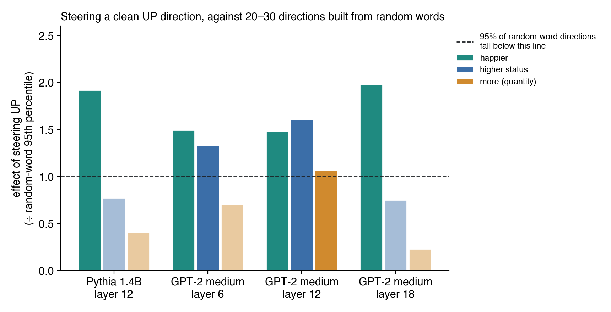
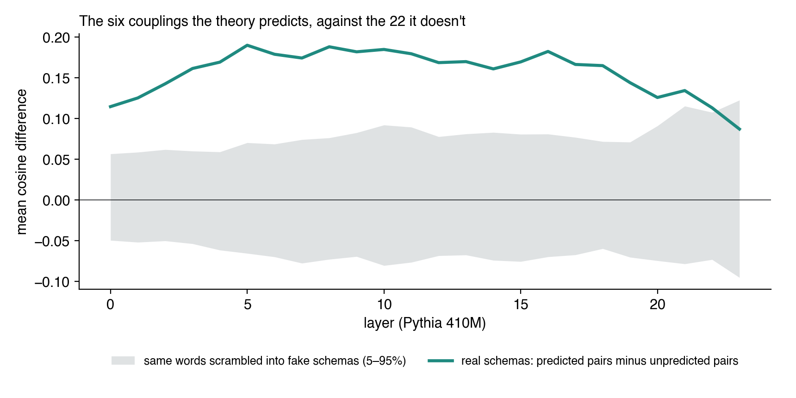
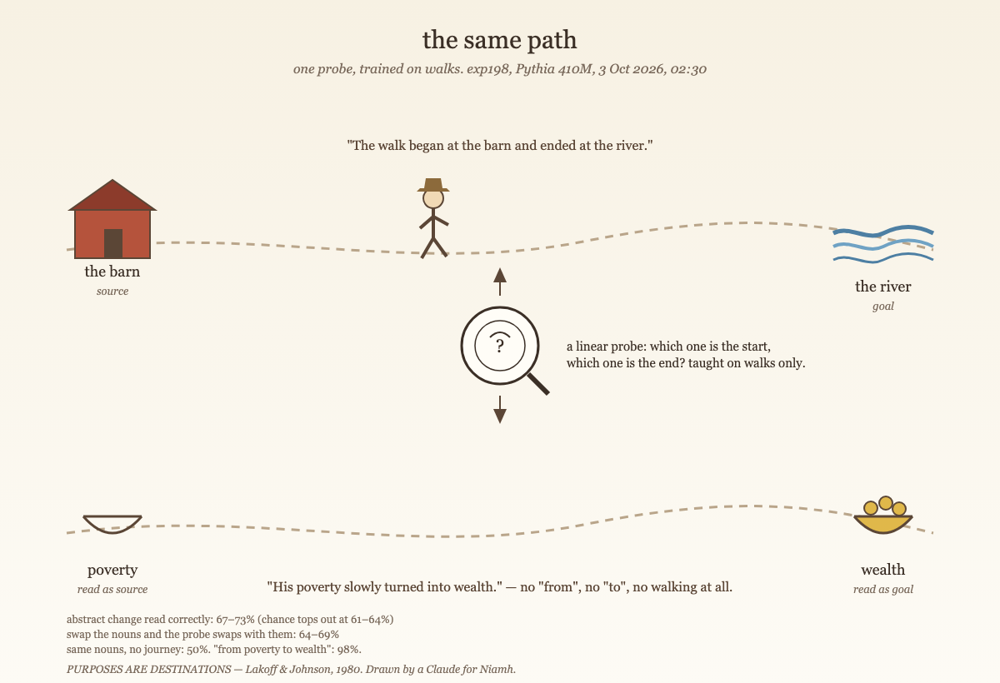

# Embodied Cognition in Transformers

*Image schemas and metaphorical mappings in language models trained on text alone*

<!-- Every number below is backed by a pre-registration in prereg/ and a raw output in results/.
     HTML comments name the files. -->

**Abstract.** Large language models write fluently about rising spirits, heavy hearts and plans that move forward. How do they come by that from text alone? One hypothesis is that human language carries a great deal of implicit information about having a body, and that a model compressing it hard enough reconstructs some of that bodily structure. Lakoff and Johnson's image schemas make the idea testable. I looked for three things. First, HAPPY IS UP: steering a model along a direction built only from spatial words makes its next word happier, beyond every one of 20–30 directions built from random words, in Pythia 1.4B and GPT-2 medium. Second, the schemas form a system: they relate to each other in the configuration the theory predicts, beyond the same words scrambled into fake schemas. Third, SOURCE-PATH-GOAL: a probe that learns where a literal walk starts and ends reads abstract change ("his poverty turned into wealth") and the input and output of an instruction ("turn this draft into a summary") the same way, and the role is relational, with no goal unless there is something to start from. This is the second version of this write-up. The first claimed more, and an audit in October 2026 took several of those claims down; the last section says what went wrong, because the faults are easy to make and worth knowing about.

*Every experiment since the audit was pre-registered, with its decision rule and committed odds, before it ran. Scripts, stimuli, raw outputs and pre-registrations: [github.com/mac-n/lakoff-schemas-in-transformers](https://github.com/mac-n/lakoff-schemas-in-transformers). The [September 2026 version](v1) is kept, with corrections at its top.*

---

Language models write about rising spirits and heavy hearts, about arguments that collapse and plans that move forward, as if the physical scaffolding under those phrases were available to them. I wanted to know how a system trained on nothing but text comes by that. My hypothesis: as well as explicit descriptions of the physical world, human language encodes a lot of implicit information about having a body, and a model that compresses human language hard enough reconstructs some of that embodiment as a projection from it.

That made me think of Lakoff.

George Lakoff and Mark Johnson argued that abstract thought is structured by *image schemas*: UP-DOWN, IN-OUT, BALANCE, FORCE, SOURCE-PATH-GOAL. These are recurring patterns of bodily experience, projected metaphorically into abstract domains: HAPPY IS UP, MORE IS UP, PURPOSES ARE DESTINATIONS. In this framework the schemas are the building blocks of meaning, and their source is the body.

From there a familiar argument runs: LLMs have no body. No body, no image schemas; no image schemas, no embodied cognitive structure; so LLM meaning is structurally defective.

I take embodied cognition seriously, and I take artificial minds seriously. I don't think those positions are incompatible, and I wanted to know what the evidence says.

  <iframe src="figures/happy_is_up.html" title="HAPPY IS UP: an 80-second animated explainer" style="position:absolute; top:0; left:0; width:100%; height:100%; border:0;" loading="lazy"></iframe>

*The first result, in 80 seconds. The tilt of the scale and the positions of the grey dots are measured values (Pythia 1.4B, layer 12). [Open it full-size](figures/happy_is_up.html).*

---

## 1. HAPPY IS UP

To test HAPPY IS UP you need the model's UP. The tool is a *contrast direction*: the average internal state for a set of UP words minus the average for their DOWN counterparts, read at one layer of the model's residual stream.

How you read those states turns out to matter a great deal (see the last section). Done properly:

- **Spatial words only.** 31 vertical pairs (*up/down, rise/fall, above/below, climb/descend, ascend/descend* ...), with no feeling words anywhere in the list.
- **Each word inside sentences.** Each word is read inside eight neutral carrier sentences, after a start token, never alone at the first position.
- **Single tokens.** Only words the tokenizer keeps whole, on both sides.
- **Frequency removed.** The direction separating common from rare words is projected out, because it otherwise leaks into everything.

Then add that direction to the model's residual stream while it completes prompts like *"Today I am feeling"*, and measure how much probability it puts on happy next words (*hopeful, optimistic, excited, happy*) against sad ones (*anxious, sad, worried, depressed, hopeless*).

Pushed up, the next word leans happier. Pushed down, it leans sadder, and the dose curve is smooth in both directions.

| steering strength | −12 | −8 | −4 | 0 | +4 | +8 | +12 | +16 |
|---|---|---|---|---|---|---|---|---|
| happy minus sad (log-prob), Pythia 1.4B L12 | −1.37 | −1.03 | −0.68 | −0.34 | −0.02 | +0.27 | +0.52 | +0.74 |

<!-- results/exp187_output.txt; cells in exp187_cells.json (not in repo: regenerate with experiments/exp187_clean_steering.py) -->

The question that matters is whether *any* push would do that. So the comparison is never zero. It is 20–30 directions built exactly the same way from random words: 31 random words minus 31 others. Those turn out to move the mood a fair amount on their own. The UP direction beats every one of them.

| model, layer | UP's effect (+8 minus −8) | random-word directions: 95th percentile | random-word directions: largest |
|---|---|---|---|
| Pythia 1.4B, 12 | **+1.35** | +0.70 | +0.96 |
| GPT-2 medium, 6 | **+0.47** | +0.31 | +0.37 |
| GPT-2 medium, 12 | **+0.59** | +0.40 | +0.51 |
| GPT-2 medium, 18 | **+0.25** | +0.13 | +0.20 |

<!-- prereg/PREREG_exp187.md, PREREG_exp194.md, PREREG_exp203.md; results/exp203_output_pythia.txt, exp203_output_gpt2.txt -->

Three further checks:

- **It isn't two vertical words in the score.** The original list of happy and sad words included *uplifted* and *low*, which are vertical themselves. Removing them changed nothing: the effect stayed the same size or grew slightly (exp203).
- **It isn't the valence direction in disguise.** UP leans toward valence more than random directions do (cosine about +0.2, at the 97th–99th percentile of random directions, across layers of Pythia 410M), but it is mostly something else. Steering along valence itself moves happiness more than twice as far.
- **MORE IS UP and STATUS IS UP depend on the model.** In Pythia 1.4B the effect is happiness only: status and quantity don't clear the random-word bar. In GPT-2, status clears it at two of the three layers and quantity at one.

**UP is HAPPY, for transformers too.**

## 2. The objection

*Of course* UP is HAPPY in the text. The corpus was written by embodied humans who think in these metaphors, and a model that compresses their language inherits their shadow. Steering shows the direction is causally live inside the model. It doesn't show it is anything more than the corpus's fingerprint.

That objection stands, and nothing here refutes it. What the next two results add is that the inheritance is *structured*: the schemas relate to each other the way the theory says, and the shape of a literal journey is reused for things that are not journeys.

## 3. Is it a system?

Lakoff's claim was never about isolated correspondences: the schemas form a coherent system. So before measuring, I wrote down six couplings the embodied logic implies:

- UP ↔ LIGHT-DARK
- LIGHT-DARK ↔ BALANCE
- FORCE ↔ DIFFICULTY
- FORWARD-BACK ↔ PATH
- UP ↔ BALANCE
- UP ↔ FORCE

Then I built eight schema directions the clean way and measured all 28 pairwise cosines at every one of Pythia 410M's 24 layers.

| | mean coupling |
|---|---|
| the 6 predicted pairs | **+0.169** |
| the 22 unpredicted pairs | +0.012 |
| difference: real schemas | **+0.157** |
| difference: the same words scrambled into 8 fake schemas of the same sizes (95th percentile of 100) | +0.080 |

<!-- prereg/PREREG_exp192.md; results/exp192_output.txt -->

The bar here is not zero. Scrambling the same words into fake schemas keeps everything about the words and destroys only which schema each belongs to. The real schemas clear that bar at every layer except the last.

- **Four predicted pairs are positive at all 24 layers:** UP–LIGHT-DARK +0.25, LIGHT-DARK–BALANCE +0.22, FORCE–DIFFICULTY +0.25, FORWARD-BACK–PATH +0.24.
- **Two are near zero:** UP–BALANCE +0.02 and UP–FORCE +0.03.
- **The most connected schema is LIGHT-DARK; the least is BALANCE.** The first version of this write-up put BALANCE at the centre of the system. That turned out to be an artefact (see the last section).

## 4. Source-path-goal: the shape of a walk, reused

The schemas above are poles: up against down, light against dark. SOURCE-PATH-GOAL is different. It is a structure with roles, a start, a path and an end, and Lakoff puts it underneath purpose itself: PURPOSES ARE DESTINATIONS, LIFE IS A JOURNEY, "where are you going with this?".

A word list can't capture roles, so this needs a different instrument. I trained a simple linear probe on the internal states of the two place-nouns in 32 sentences about literal journeys, to tell the start from the end. None of the sentences contains *from* or *to*: *"The walk began at the barn and ended at the river"*, *"Their destination was the lake; their starting point was the cabin."* Half name the end first, so word order can't do the work. Then I showed the probe things that are not walks.

| shown | reads start / end correctly | chance (95th percentile of shuffled-label probes) |
|---|---|---|
| abstract change, no *from/to*: *"His poverty slowly turned into wealth"* (Pythia 410M, layer 8; 12–20 slightly higher) | **67%** (70–73%) | 61% (64%) |
| abstract change with *from/to*, words the probe never saw: *"from poverty to wealth"* (Pythia, layer 8) | **98%** | |
| instructions: *"Turn this draft into a summary"* (Llama-3.2-1B base, layer 6) | **75%** | 66% |
| the same, Llama-3.2-1B-Instruct, layer 6 / layer 3 | 72% / 72% | 67% / 66% |

<!-- prereg/PREREG_exp198.md, PREREG_exp199.md; results/exp198_output_*.txt, exp199_output_*.txt -->

Two controls make this more than word association:

- **Swap the nouns and the probe follows the roles.** In *"His wealth slowly turned into poverty"*, wealth is now read as the start (Pythia 66%; Llama base 78%).
- **The same nouns with nothing happening sit at chance.** *"The grief and the joy were both discussed at length"* scores 50%.

Where it falls short of the pre-registered rule, I say so here. In GPT-2 the transfer appears at layer 16, not the layer 8 I named in advance. In Llama-Instruct the swap test falls one point short of the bar at the named layer, and everything passes at layer 3. The readout lives in the early-to-middle layers and is gone by layer 10 in Llama.

**The role is relational.** "Write a haiku about rain" names a thing asked for with nothing to start from. Scored against the same word in a sentence where nothing happens, the haiku is *not* marked as a goal, in base or instruct (exp200). What the deep layers mark instead is simply "this word is in an instruction". A goal, for these models, is the far end of something. That is what Lakoff's schema says too: a destination exists relative to a start and a path.

## 5. In progress: what happens to a goal while the model carries it out?

In Llama-3.2-1B-Instruct, which form an instruction asks for (haiku, limerick, list, email, joke or story) can be read perfectly from the last token before the answer begins, with the topic held out. Swapping that state in from another prompt nudges the answer toward the other form, which shows the state is causal. Then, subtracting what the text itself shows (by running the same answer after a neutral request), I tracked the goal signal through the answer:

- **It declines while the model writes.** In answers that finished, it falls from 0.17 to 0.07 of its starting strength. This replicated in a second run.
- **It levels off once the answer is done**, rather than vanishing.
- **Whether that decline is the goal being used up, or the instruction simply getting further away, is not settled.** My test of it (asking for one haiku versus three) failed for an instructive reason: asking for more weakens the goal from the very start, so the two lengths don't begin from the same place.

<!-- prereg/PREREG_exp201.md, PREREG_exp202.md -->

## 6. What the audit found

The first version of this write-up reported five headline findings. An audit in October 2026 kept two, and the faults behind the other three are worth setting out, because they are easy to make and they produce convincing results.

1. **No start token.** Pythia's tokenizer doesn't add one, so a bare word sat at position 0, where the model's internal states are roughly forty times larger than anywhere else and behave differently. Directions built that way were partly "first-position" directions.
2. **Whole words against fragments.** In several word lists, one end was mostly words the tokenizer keeps whole and the other mostly words it splits into pieces (for BALANCE in GPT-2's tokenizer, 9 of 15 whole on one side against 0 of 15 on the other). The "schema" direction was then partly a whole-word-versus-fragment direction. Random word lists with the same imbalance reproduce the couplings I had attributed to BALANCE (exp178).
3. **The wrong baseline.** Directions built from random words correlate with model internals at |r| 0.2–0.3. Judged against zero, almost anything looks like a finding.
4. **What sits next to the slot.** One effect replicated twice before I saw where it came from: in my carrier sentences the word *and* followed the slot, and "up and ___" strongly expects "down". The model was completing fixed pairs, not computing opposition (exp180).

**Withdrawn:** the inflectional suffixes sinking onto BALANCE; the contrast with word2vec and GloVe that rested on it; BALANCE coupled to the residual-stream norm (Pythia) and to attention entropy (GPT-2, Llama); and the causal-direction and training-checkpoint results built on those. **Survived:** HAPPY IS UP, and the predicted schema system without BALANCE at its centre. The full list, with each re-test, is in [audit_2026-10/](https://github.com/mac-n/lakoff-schemas-in-transformers/tree/main/audit_2026-10).

If you build directions from word lists:

- **Put the words inside sentences**, after a start token.
- **Use single-token words on both sides.**
- **Look at what your carrier sentences put next to the word.**
- **Compare against random word lists, not zero.**

## 7. Conclusions

- **UP moves happiness, causally**, beyond every random-word direction, in two model families. In GPT-2 it reaches status and quantity too.
- **The schemas form the system the theory predicts**, beyond the same words scrambled into fake schemas.
- **Source-path-goal structure learned from literal journeys reads abstract change and the two ends of an instruction**, and it is relational: no start, no goal.

None of this shows the structure is more than the corpus's fingerprint. It shows that the fingerprint is organised the way Lakoff said human thought is, and that a model reuses the shape of a walk for things that are not walks. The stronger claims of the first version, about a schema anchored on the model's own computation, did not survive. I would rather know.

## Related work

The philosophical background is the embodied-cognition tradition: Lakoff & Johnson's *Metaphors We Live By* (1980) and *Philosophy in the Flesh* (1999), and Johnson's *The Body in the Mind* (1987). The best-known "no grounding from form alone" argument is Bender & Koller's "Climbing towards NLU" (ACL 2020). Its target is communicative intention and world reference rather than internal conceptual structure, so these results bear on the disembodiment inference, not on that argument as formulated.

A growing literature shows text-only models recovering structure that mirrors perceptual spaces: Abdou et al. (CoNLL 2021) on colour, Patel & Pavlick (ICLR 2022) on grounded conceptual spaces, Gurnee & Tegmark (ICLR 2024) on space and time. Anthropic's work on emotion concepts in a large model (Sofroniew et al., 2026) finds functional emotion directions built from stories; the random-word baseline used here is a check I would recommend for any direction built from word lists.

On goals in instructions: task and function vectors (Hendel et al., EMNLP Findings 2023; Todd et al., ICLR 2024) and instruction steering vectors (Stolfo et al., ICLR 2025) show that models carry a compact, causal state for the task they are doing. Dong et al. (ICML 2025) show that features of a response can be read from the prompt before generation, with a dip mid-response. The source/goal transfer from literal journeys and the relational result appear to be new.

Methodologically the work builds on activation steering (Turner et al., ActAdd, arXiv:2308.10248; Zou et al. 2023) and the linear-representation tradition (Mikolov et al. 2013; Park et al., ICML 2024), with the hazards of anisotropy (Ethayarajh, EMNLP 2019) and massive activations (Sun et al., COLM 2024) in view throughout. Massive activations at the first position are part of why the start-token fault mattered.

## Open questions

1. **Is a goal spent as it's reached?** This needs a design that varies how much work is left without changing the request.
2. **Source-path-goal beyond language.** Does the walk-trained probe read the start and goal in a map given as coordinates, or the input and output of a line of code? Does it run the other way, from maps to sentences?
3. **A layer sweep for the steering result**, and larger models.
4. **Why GPT-2 extends UP to status and quantity while Pythia keeps it to mood.**

## Methods note

Models: Pythia 410M and 1.4B, GPT-2 medium, and Llama-3.2-1B base and instruct, all through TransformerLens or Hugging Face transformers on a single Mac. Schema directions were built from single-token words read inside eight neutral carrier sentences after a start token, with the frequency direction (common minus rare words) projected out. Every effect was judged against directions built the same way from random words, or against label-shuffled probes, never against zero. Every experiment from exp174 on was pre-registered before it ran, with a decision rule and committed odds, then graded. Where a rule turned out to be badly built, the verdict was kept and the fault recorded beside it. My hypotheses were written down in my own words, with timestamps, before any data were seen.

The research was conducted as a collaboration between the author and Claude (Anthropic) across many sessions.

---

*Niamh McCombe, 2026. Code, stimuli, raw outputs and pre-registrations at [github.com/mac-n/lakoff-schemas-in-transformers](https://github.com/mac-n/lakoff-schemas-in-transformers). The [September 2026 version](v1) of this write-up is kept, with corrections.*
